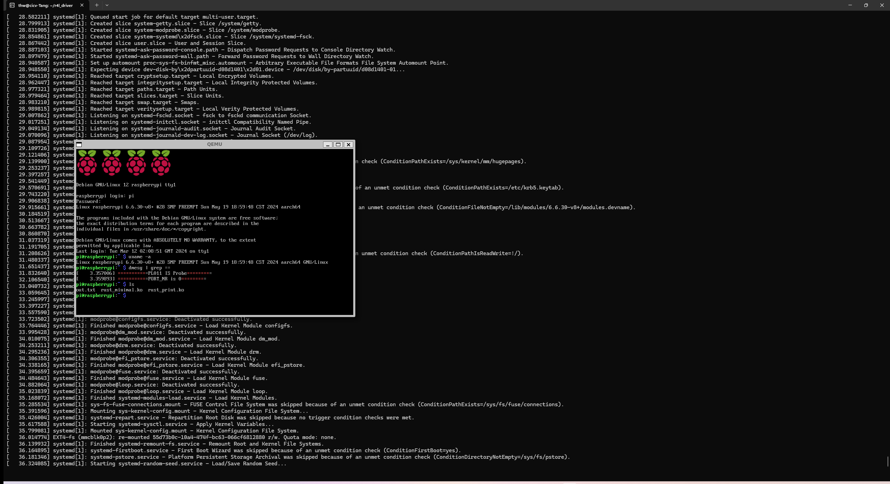
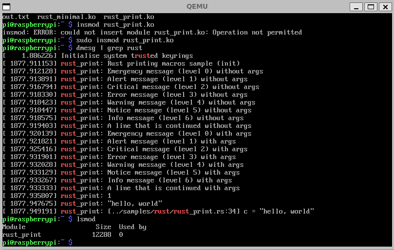
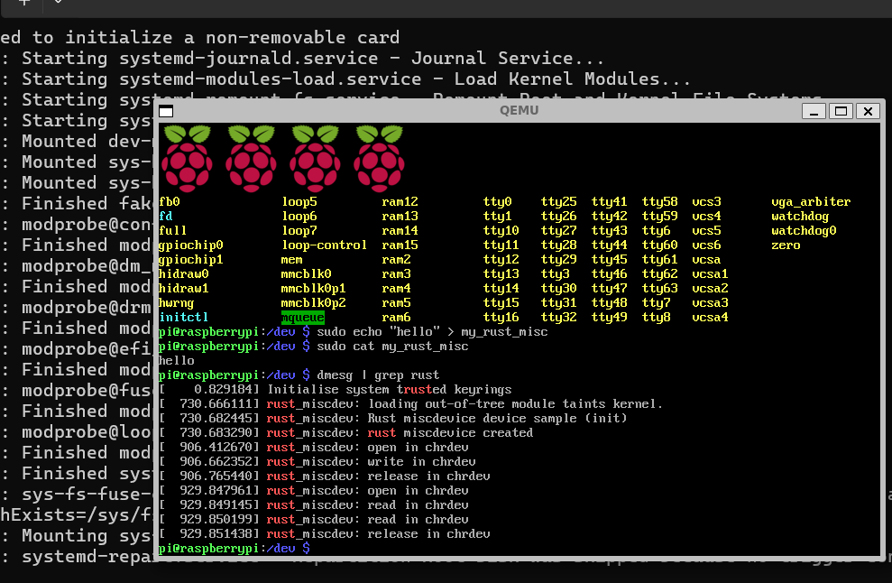

## 项目3 Rust for Linux & 跨内核驱动框架

### 1. 树莓派模拟环境搭建

1. 需要Linux系统，以便进行内核开发。可以在物理机上安装Linux，也可以使用虚拟机的形式。（如Windows下的WSL2，或者VirtualBox、VMWare），**推荐安装WSL2**，相关安装可参考网上资料。关于Linux发行版，我们建议使用Ubuntu LTS 20.04即可,其他如Debian,Arch, Fedora等,注意使用的包管理器和包名与Deb系的略有区别，需要自行解决。
2. Rust的安装不过多强调，应该都安装了。

#### -  环境配置
进入Linux环境，项目的开发将在r4l_drivers里面进行，该项目目录将会包含以下内容：
```
r4l_driver
    |- linux_raspberrypi                           (树莓派linux kernel源码)
    |- qemu                                        (qemu模拟环境)
    |- 2024-03-12-raspios-bookworm-arm64-lite.img  (官方树莓派镜像)
    |- firmware                                    (用于挂载镜像分区1)
    |- rootfs                                      (用于挂载镜像分区2)
    |- userconf                                    (初始用户文件)    
    |- boot.sh                                     (qemu启动脚本)
```

通过以下命令创建项目，并作用到环境变量 `.bashrc` or `.zshrc`

```sh
mkdir /path/to/your/r4l_drivers/
echo "export R4L_DRV=$(pwd)" >> ~/.bashrc
source ~/.bashrc
```

**获取树莓派官方xz镜像文件**

```sh
cd $R4L_DRV
wget https://downloads.raspberrypi.com/raspios_lite_arm64/images/raspios_lite_arm64-2024-03-13/2024-03-12-raspios-bookworm-arm64-lite.img.xz
xz -dk 2024-03-12-raspios-bookworm-arm64-lite.img.xz
sync
sudo rm 2024-03-12-raspios-bookworm-arm64-lite.img.xz
```
**Qemu9.0 模拟器安装和使用**

```sh
cd $R4L_DRV
# 安装编译所需的依赖包
sudo apt install autoconf automake autotools-dev curl libmpc-dev libmpfr-dev libgmp-dev \
              gawk build-essential bison flex texinfo gperf libtool patchutils bc \
              zlib1g-dev libexpat-dev pkg-config  libglib2.0-dev libpixman-1-dev libsdl2-dev \
              git tmux python3 python3-pip ninja-build
# 下载源码包           
wget https://download.qemu.org/qemu-9.0.0.tar.xz
tar -xvf qemu-9.0.0.tar.xz
rm qemu-9.0.0.tar.xz
cd qemu-9.0.0 && mkdir build
cd build && ../configure --target-list=aarch64-softmmu,arm-softmmu
make -j$(nproc)

# 作用到环境变量 `.bashrc` or `.zshrc`
echo "export PATH=\$PATH:$R4L_DRV/qemu-9.0.0/build/" >> ~/.bashrc
source ~/.bashrc
#验证qemu是否安装成功
qemu-system-aarch64 --version
#出现以下信息表示安装成功:
# QEMU emulator version 9.0.0
# Copyright (c) 2003-2024 Fabrice Bellard and the QEMU Project developers
```
**树莓派 linux安装和编译**

```sh
cd $R4L_DRV
git clone --depth=20 https://github.com/happy-thw/linux_raspberrypi.git
cd linux_raspberrypi
# Requires dependent libraries
apt install libelf-dev libgmp-dev libmpc-dev bc flex bison u-boot-tools
apt install llvm-17 lld-17 clang-17  
# 这里选择的是clang-17的版本，rust for linux 最少也要12以上，并且下面的LLVM根据相应的版本选择

# Requires Rust dependent libs
rustup override set $(scripts/min-tool-version.sh rustc)
rustup component add rust-src
cargo install --locked --version $(scripts/min-tool-version.sh bindgen) bindgen-cli
make ARCH=arm64  O=build_4b LLVM=-17 rustavailable 
# Rust is available!  即支持rust

make ARCH=arm64 O=build_4b LLVM=-17 bcm2711_rust_defconfig
make ARCH=arm64 O=build_4b LLVM=-17 -j$(nproc)

# (可选项) 修改.config可通过
make ARCH=arm64 O=build_4b LLVM=-17 menuconfig
# (可选项) 保存修改的.config为默认config
make ARCH=arm64 O=build_4b LLVM=-17 savedefconfig && mv build_4b/defconfig arch/arm64/configs/bcm2711_rust_defconfig
# (可选项) 删除之前编译所生成的文件和配置文件
make ARCH=arm64 O=build_4b LLVM=-17 mrproper
# (可选项) 使用rust-analyzer
make ARCH=arm64 O=build_4b LLVM=-17 rust-analyzer

# 没有出现error，则编译成功，相应的kernel镜像文件和设备树文件在以下路径
ls ./build_4b/arch/arm64/boot/Image
ls ./build_4b/arch/arm64/boot/dts/broadcom/*.dtb
```

**启动树莓派模拟环境**

```sh
cd $R4L_DRV
fdisk -l 2024-03-12-raspios-bookworm-arm64-lite.img
#得到以下信息：
# Disk 2024-03-12-raspios-bookworm-arm64-lite.img: 4 GiB, 4294967296 bytes, 8388608 sectors
# Units: sectors of 1 * 512 = 512 bytes
# Sector size (logical/physical): 512 bytes / 512 bytes
# I/O size (minimum/optimal): 512 bytes / 512 bytes
# Disklabel type: dos
# Disk identifier: 0xd08d1401

# Device                                      Boot   Start     End Sectors  Size Id Type
# 2024-03-12-raspios-bookworm-arm64-lite.img1         8192 1056767 1048576  512M  c W95 FAT32 (LBA)
# 2024-03-12-raspios-bookworm-arm64-lite.img2      1056768 5406719 4349952  2.1G 83 Linux

#根据img1 Start的信息，将分区1挂载到firmware下，该分区里面存放了启动引导和配置的相关文件
mkdir firmware
sudo mount -v -o offset=$((512*8192)) 2024-03-12-raspios-bookworm-arm64-lite.img firmware

# 里面可以看到相应的kernel镜像，配置文件和设备树文件
# 卸载
sudo umount 2024-03-12-raspios-bookworm-arm64-lite.img firmware

#另外需要给镜像扩容
qemu-img resize 2024-03-12-raspios-bookworm-arm64-lite.img 4G
qemu-img info 2024-03-12-raspios-bookworm-arm64-lite.img

#创建boot.sh脚本，用于启动qemu，虽然qemu9.0版本开始支持树莓派4B，但是尝试后发现键盘没有作用-.-，因此启动树莓派3B+也能满足项目需求
#以下是boot.sh的内容
#!/bin/sh
kernel_image="linux_raspberrypi/build_4b/arch/arm64/boot/Image"
kenrnel_dtb="linux_raspberrypi/build_4b/arch/arm64/boot/dts/broadcom/bcm2710-rpi-3-b-plus.dtb"
IMG="2024-03-12-raspios-bookworm-arm64-lite.img"
qemu-system-aarch64 \
        -machine type=raspi3b \
        -m 1024 \
        -k en-us \
        -dtb $kenrnel_dtb \
        -kernel $kernel_image \
        -drive id=hd-root,format=raw,file=$IMG \
        -append "rw earlycon=pl011,0x3f201000 console=ttyAMA0 loglevel=8 root=/dev/mmcblk0p2 \
        fsck.repair=yes net.ifnames=0 rootwait memtest=1 dwc_otg.fiq_fsm_enable=1" \
        -serial stdio \
        -usb -device usb-kbd \
        -device usb-tablet -device usb-net
        

#启动boot.sh
chmod 777 boot.sh
./boot.sh
# 可能启动会比较慢一点...
```

结果如下：



附：感兴趣的可以尝试下启动树莓派4B，执行命令如下：

```sh
cd $R4L_DRV
qemu-system-aarch64 \
	-machine raspi4b \
	-cpu cortex-a72 \
	-smp 4 \
	-m 2G \
	-kernel linux_raspberrypi/build_4b/arch/arm64/boot/Image \
	-dtb linux_raspberrypi/build_4b/arch/arm64/boot/dts/broadcom/bcm2711-rpi-4-b.dtb \
	-drive id=hd-root,format=raw,file=2024-03-12-raspios-bookworm-arm64-lite.img \
	-append "rw earlycon=pl011,0x3f201000 console=ttyAMA0 loglevel=8 \
	root=/dev/mmcblk1p2 rootfstype=ext4 rootwait memtest=1 dwc_otg.fiq_fsm_enable=0" \
	-serial stdio -device usb-kbd -device usb-tablet
```

**加载linux驱动模块**

在sample里面已有R4L社区提交的一些驱动模块，在路径`./linux_raspberrypi/build_4b/samples/rust`下,把`rust_print.ko`移动到qemu环境里去

```sh
cd $R4L_DRV
mkdir rootfs
#根据前面img2 Start的信息，将分区2挂载到rootfs目录，该分区是根文件系统
sudo mount -v -o offset=$((512*1056768)) 2024-03-12-raspios-bookworm-arm64-lite.img rootfs
sudo cp ./linux_raspberrypi/build_4b/samples/rust/*.ko ./rootfs/home/pi/
#卸载
sudo umount 2024-03-12-raspios-bookworm-arm64-lite.img rootfs
#重新启动qemu，此时在qemu环境下就能看到放进来的驱动模块了（想通过网络传输的，但是wsl2好像没这么简单...）
```

驱动加载演示如下所示



以上就是通过QEMU的树莓派模拟环境去进行驱动开发的过程。

相关问题解决：

1.修改初始密码，在qemu树莓派环境中通过`sudo raspi-config`进行配置，参考链接:[系统配置 | Raspberry Pi 树莓派 (pidoc.cn)](https://pidoc.cn/docs/computers/configuration)

2.键盘输入乱码，是键盘布局不对，树莓派(raspberry pi)是英国产品，默认键盘布局是英国(GB)，参考[树莓派(raspberry pi)学习4: 更改键盘布局_树莓派配置键盘布局-CSDN博客](https://blog.csdn.net/c80486/article/details/8460271)


### 2. 树莓派开发板硬件驱动开发

相关硬件：1.树莓派4B开发板  

​					2.HDMI线和显示屏  

​					3.串口TTL转USB模块 

​                    4.网线  

​            		5.面包板、电阻和LED小灯（不一定需要）

根据官方文档进行镜像烧录，同样选择https://downloads.raspberrypi.com/raspios_lite_arm64/images/raspios_lite_arm64-2024-03-13/2024-03-12-raspios-bookworm-arm64-lite.img.xz，通过HDMI和显示屏查看树莓派硬件启动阶段的相关信息，尤其是无线连接的IP地址，然后通过SSH方式就可以进入树莓派终端了。

linux开源下载&编译方式和前面qemu里面步骤相同。

考虑到无线wifi的ip是动态分配的，可配置有线网络的静态IP，命令如下：

```sh
sudo nmcli -p connection show

# Sample static IP configuration:
sudo nmcli c mod 'Wired connection 1' ipv4.addresses 20.6.2.199/22 ipv4.method manual
sudo nmcli con mod 'Wired connection 1' ipv4.gateway 20.6.2.1
sudo nmcli con mod 'Wired connection 1' ipv4.dns "20.6.2.1"
sudo nmcli c down 'Wired connection 1' && sudo nmcli c up 'Wired connection 1'
# 其中IP,掩码,网关，DNS根据自己的情况进行配置
```

驱动模块通过scp就可以进行传输。

另外还有相关的系统配置问题，可参考树莓派文档进行查看：[系统配置 | Raspberry Pi 树莓派 (pidoc.cn)](https://pidoc.cn/docs/computers/configuration)


### 练习一： 根据上面的方法配置环境，编写和加载HelloWorld的驱动模块。完成后截图。

### 练习二： 实现`Miscdev`驱动基本读写
- 远端仓库(https://github.com/happy-thw/linux_raspberrypi/commit/ca5198f6449b4076f3a48df9c9a7e71460977cab)更新了练习二的内容，添加了一个samples/rust/rust_miscdev.rs文件，但是没有绑定驱动；
- 按要求添加配置项，补充内容，使得杂项字符设备可以实现基本读写操作。
- 提示：里面缺少到miscdev抽象文件可以从rust for linux社区rust分支获取。
- 测试样例：
```
//! How to build only modules:
//! make LLVM=-17 O=build_4b ARCH=arm64 M=samples/rust
//!
//! How to use in qemu:
//! / # sudo insmod rust_miscdev.ko
//! / # sudo cat /proc/misc  -> c 10 122
//! / # sudo chmod 777 /dev/rust_misc
//! / # sudo echo "hello" > /dev/rust_misc
//! / # sudo cat /dev/rust_misc  -> Hello
//!
``` 
- 测试结果如图：  
